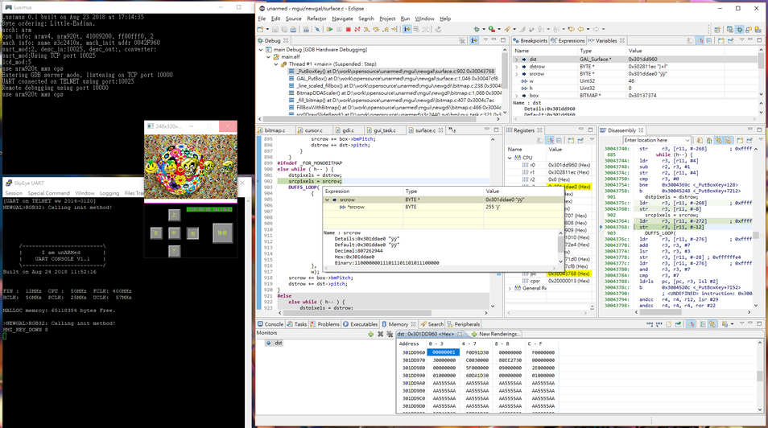

# lusimus
A fork of SkyEye 1.2.8 rc1. Lusimus is a total system simulator for Windows

It's real, look !!!

Currently stably simulating an s3c2440 demo board only, the one that I am sure of to work as expected. It is equipt a GDB server, capable of source-level single-step debuging with breakpoint and variable access in Eclipse CDT environment with GNU MCU (Previously GNU ARM)Eclipse plugin. 

This ancient work has been lying in hard disk for years. Since it was taken from open source community, I might as well I put it up for anyone needed.

The original SkyEye can be obtained here <a>https://sourceforge.net/projects/skyeye/</a>  
Said on the project page, It can simulate series ARM, Coldfire,Mips, Powerpc, Sparc, x86, TI DSP and Blackfin DSP Processor. I believe the creator of SkyEye took a bit of Armulator, a bit of this, a bit of that, and more bits of something from somewhere, then assemble them together. It seems all there alright, A lot of unfinished, unworkable codes in every components make it impossible to do any of it at all. The only configuration that I was able to bring it up is s3c2410, but still it randomly crashed every time I try to run anything.

There was no instructions about how to compile it and how to setup the environment for the job, so when I tried to compile it for the first time, the results was thousands of errors and warnings. I fixed them one by one, every each of them, took me 7 days and 7 nights to get it done, literally !!! Unused and set but unused variables was easy parts, just go thourhgt each source file to take them out, more are ambiguous expressions, oblivioius wrong mathenmatic calculations, missing parentheses, symbols redefined with different values...(the list is quite long, so I'll just stop here).

The linking was another big chanllange too, thousands of conflicts and undefined calls with system libs and its own ones. That took me another sleepless 7 nights and days, finally, I was reborned. You can be reborned too, just take original source package and try it out.

You know, ~~I thought I have seen Linux Kernel source codes,~~ I thought I have seen enough in 30 years as a professional, Life never stops scares me from time to time. I Can't imagine how and why a ~~good~~ avarage programmer can endure such hugh amount of compiler warnings, and yet still consider the state is a release to be. I have came throught the long and winding road, so you don't have to be in hell and burned for 14 days (at least).

