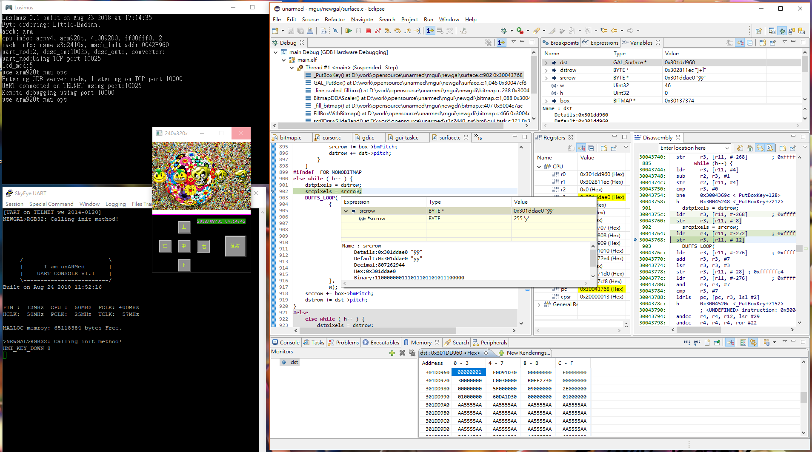

# Lusimus
A fork of SkyEye 1.2.8 rc1. Lusimus is a total system simulator for Windows 7/8/10

look!!! It's real!!! 

Currently stable simulating an s3c2440 demo board only, the one that I am sure of to work as expected. As you can see in the image above, an LCD, UART console via TELNET protocol. It is equipped with a GDB server, capable of source-level single-step debugging with breakpoint, variable and memory access in Eclipse CDT environment with GNU MCU (Previously GNU ARM) Eclipse plugin. 

This ancient work has been lying in hard disk for years. Since it was taken from open source community, I might as well I put it up for anyone needed. It was built by using an old ARM toolchain YAGARTO, now I refurbished using newer arm-none-eabi toolchain.

The original SkyEye can be obtained here <a>https://sourceforge.net/projects/skyeye/</a>  
Said on the project page, It can simulate series ARM, Coldfire,Mips, Powerpc, Sparc, x86, TI DSP and Blackfin DSP Processor. I believe the creator of SkyEye took a bit of Armulator, a bit of this, a bit of that, and more bits of something from somewhere, then assemble them together like...like Frankenstein. It seems all there alright, A lot of unfinished, unworkable codes in every components in every code file that makes it impossible to do any of them at all. The only configuration that I was able to bring up is s3c2410, but still it randomly crashed after runing few instructions every time I try to launch anything.

There was no instructions about how to compile it and how to setup the environment for the job, so when I tried to compile it for the first time, the results was thousands of errors and warnings. I fixed them one by one, every each of them, took me 7 days and 7 nights to get it done, literally!!! Unused and set but unused variables was easy parts, just go through each source file to take them out, more are ambiguous expressions, oblivious wrong mathematic calculations, missing parentheses, symbols redefined with different values...(the list is quite long, so I'll just stop here).

The linking was another big challenge too, thousands of conflicts and undefined calls with system libs and its own ones. That took me another sleepless 7 nights and days, finally, I was reborn. You can be reborn too, just take original source package and try it out.

You know, <s>I thought I have seen Linux Kernel source codes,</s> I thought I have seen enough in 30 years as a professional, Life never stops scares me from time to time. I failed imagine how and why a <s>good</s> average programmer can endure such huge amount of compiler warnings, and yet still consider the state is a release to be. I have come through the long and winding road, so you don't have to be in hell and burned for 14 days (at least).

Enough complains, now get to the point.

## Building Environment

 *I like to work in a GUI environment, it's more efficient. Since codes I provided are projects in Eclipse, if you are a CLI enthusiast...Hmmm...TBD...* 

 *I put them together some time ago, Newer versions of following components should be applicable if there are any.*

 * Windows 7/8/10 (I am on 10)
 

 * Java Runtime Environment (Required by Eclipse, I use version 8u172)
 
 
 * GNU MCU Eclipse IDE for C/C++ Developers Oxygen.3a 20180419 [Download page](https://github.com/gnu-mcu-eclipse/org.eclipse.epp.packages/releases/tag/v4.3.3.20180419-o3a "Download GNU MCU Eclipse")  
	The Eclipse Oxygen.3a that came with GNU MCU pre-installed.  
	File name: **20180419-1818-gnumcueclipse-4.3.3-oxygen-3a-win32.win32.x86(_64).zip**
	
	
 * GNU Arm Embedded Toolchain [Download page](https://developer.arm.com/open-source/gnu-toolchain/gnu-rm/downloads "Download GNU Arm Embedded Toolchain")  
 	File name: **gcc-arm-none-eabi-7-2018-q2-update-win32-sha2.exe**
 	
 	
 * MinGW [Download page](https://sourceforge.net/projects/mingw/files/ "Download MinGW")
 	Just hit the green download button, get the file mingw-get-setup.exe, this is a package installer, not the actual MinGW. For what packages to install explain later.
 	
 	
 * EGit, the Git integration for Eclipse 4.6.0 (Optional)  
 	Install it from Eclipse Marketplace.
 	Any other git client will do the same job.
 	 
 	
##### MinGW packages to install
Basic Setup:  
 * mingw-developer-toolkit
 * mingw32-base
 * mingw32-gcc-g++
 * msys-base
 
All Packages:  
 * MinGW -> MinGW Base System -> mingw32-binutils-dev

And the missing lib "iberty", download it manually:
 * [Download page](https://sourceforge.net/projects/mingw/files/MinGW/Base/binutils/binutils-2.28/ Download libiberty) on SourceForge  
	File name: **libiberty-2.28-1-mingw32-dev.tar.xz**  
	Extract content into mingw root directory (e.g. C:\MinGW).

***

When the environment is properly set up, and you got the project from github, you can create a workspace with Eclipse in the project root directory, build each lib projects and last build the main project, then you are done.
 
Well, That all for now.
 
 
  

